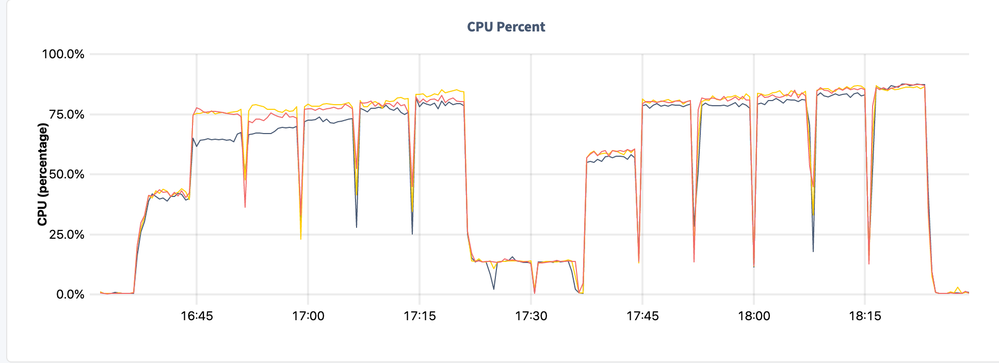
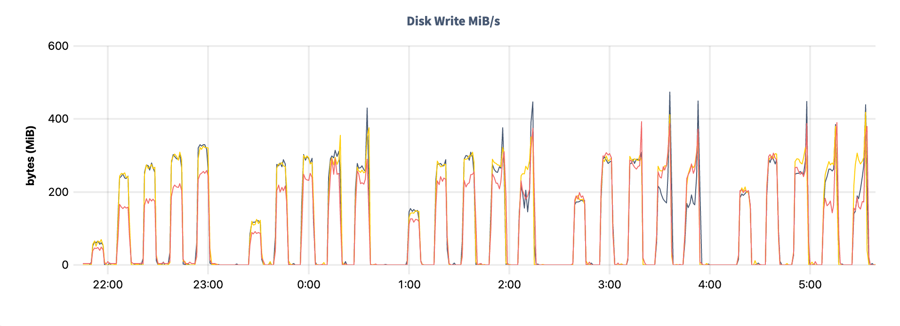

# Kafka 2 CockroachDB via JDBC Sink Connector

This is a short write up on the exercise of inserting batches of Kafka Records into [CockroachDB](https://www.cockroachlabs.com/product/) using Confluent's [JDBC Sink Connector](https://docs.confluent.io/kafka-connectors/jdbc/current/sink-connector/overview.html), a 'no-code' solution for data ingestion.

The pipeline is very simple:

1. A python script generates data that gets ingested into a Kafka Topic withing the Kafka Broker.
2. The Topic is partitioned.
3. Exactly 1 Kafka Connect _task_ is started for each partition.
4. The Task reads from the topic partition and inserts into CockroachDB by making a conneciton through the Load Balancer.

## Test Infrastructure and Components Setup

Infrastructure was deployed using Ansible on Google Cloud VMs:

- Single node Confluent Platform (Kafka broker and Kafka Connect) on `n2-standard-16` instance type.
- 3 nodes CockroachDB cluster using the `n2d-standard-8|16|32` instance types.
  Each VM was provisioned with 1 x 2.5TB Persistent SSD (`pd-ssd`) volume.
- Single node Load Balancer instance running HAProxy.

The main Kafka backend was installed using the [Ansible Playbooks for Confluent Platform](https://docs.confluent.io/ansible/current/overview.html).

The CockroachDB cluster and the HAProxy load balancer instance were installed using the [`fabiog1901.cockroachdb` Ansible Collection](https://github.com/fabiog1901/cockroachdb-collection).

The test was run executing convenience Python script `play.py`.
The script coordinates the execution of 4 Ansible Playbooks:

1. `kafka.yaml` - Provision and prepare the Kafka cluster.
2. `cockroachdb.yaml` - Provision and prepare the CockroachDB cluster.
3. `kafka-producer.yaml` - Prepare Kafka broker and start the Kafka producer.
4. `kafka-consumer.yaml` - Run the Kafka consumer i.e. Kafka Connect.

### Kafka Producer

To load data into the Kafka Topic we used a simple generator written in Python, `libs/gen.py`.
The generator leverages the `confluent-kafka` [package](https://github.com/confluentinc/confluent-kafka-python) for publishing Avro records of about 60 fields.
The generator is started and let run for 20 minutes before any consumer process is started, so that the Topic is always well filled with records.

### Kafka Consumer

Kafka Connect was configured with the **JDBC Sink Connector**, however, a custom `kafka-connect-jdbc-10.6.1.jar` file was used: the only change made to the original version was to set `autocommit=true` for the SQL transactions, [here](https://github.com/confluentinc/kafka-connect-jdbc/blob/v10.6.1/src/main/java/io/confluent/connect/jdbc/sink/JdbcDbWriter.java#L57).
This change is important as it allows statements to be executed implicitly, saving therefore a roundtrip for the commit message.
The Jar file can be found in the `libs` directory.

Similarly, a custom [PostgreSQL JDBC Driver](https://jdbc.postgresql.org/) was used, allowing for batch statements to be larger than 128 records, see [here](https://github.com/pgjdbc/pgjdbc/blob/REL42.5.0/pgjdbc/src/main/java/org/postgresql/jdbc/PgPreparedStatement.java#L1726).
The result is we can now test with multi-value INSERT statements that have more than 128 values.
The custom driver Jar file is also in the `libs` directory.

## CockroachDB Cluster

The 3 nodes CockroachDB cluster runs version 22.2.5|6.
The database was seeded with approximately 0.5TB of data.
The data was generated externally and imported from Google Cloud Storage directly into the database.
CockroachDB stored the data with a Replication Factor of 3, the default.
This implies that every single node has a full copy of the entire dataset.
See custom settings and DDL statements executed in file `libs/s.sql`.

## Test Description

We tested with 3 **instance types**, multiple Kafka topic **partitions** and **batch sizes**.

Script `play.py` was used to run the tests.
In short, for each instance type, we cycled through all partitions, and for each partition, we cycled through all batch sizes.

On each **partition** cycle, the JDBC Sink Connector was created with `tasks.max` set to the same number as the partition count.
Here, a _task_ is a process that creates a database connection, consumes records from the assigned topic partition, prepares the INSERT statement and finally sends it to CockroachDB for execution.

On each **batch size** cycle, the JDBC Sink Connector was created with `batch.size` and `consumer.override.max.poll.records` set to the current `batch_size` value.

Results of transaction latency, throughput (TPS) and CPU util are shown below for each of the test cases.
`per_stmt_latency_ms` is a computed value, derived by dividing `txn_latency_ms` by `batch_size`.

### Using n2d-standard-8

| total_vcpus | k_partitions | batch_size | tps   | cpu_util_pct | txn_latency_ms | per_stmt_latency_ms |
| -----------:| ------------:| ----------:| -----:| ------------:| --------------:| -------------------:|
| 24          | 18           | 1          | 3160  | 40           | 3.0            | 3.00                |
| 24          | 18           | 8          | 9984  | 70           | 10.7           | 1.34                |
| 24          | 18           | 16         | 12064 | 70           | 19.3           | 1.21                |
| 24          | 18           | 32         | 14457 | 75           | 32.7           | 1.02                |
| 24          | 18           | 64         | 15920 | 75           | 59.9           | 0.94                |
| 24          | 18           | 128        | 17820 | 80           | 105.3          | 0.82                |
| 24          | 36           | 1          | 5839  | 60           | 3.3            | 3.30                |
| 24          | 36           | 8          | 10653 | 80           | 22.4           | 2.80                |
| 24          | 36           | 16         | 11854 | 80           | 41.7           | 2.61                |
| 24          | 36           | 32         | 13923 | 80           | 71.4           | 2.23                |
| 24          | 36           | 64         | 15765 | 85           | 126.9          | 1.98                |
| 24          | 36           | 128        | 17684 | 85           | 219.0          | 1.71                |

_Overview Dashboard -> SQL Statements_

_Hardware Dashboard -> CPU Utilization_

_SQL Activity --> Transaction page - data for the 18 partitions test_

### Using n2d-standard-16

| total_vcpus | k_partitions | batch_size | tps   | cpu_util_pct | txn_latency_ms | per_stmt_latency_ms |
| -----------:| ------------:| ----------:| -----:| ------------:| --------------:| -------------------:|
| 48          | 18           | 1          | 2955  | 20           | 3.3            | 3.30                |
| 48          | 18           | 16         | 12104 | 65           | 19.0           | 1.19                |
| 48          | 18           | 32         | 13824 | 65           | 35.0           | 1.09                |
| 48          | 18           | 64         | 16187 | 70           | 61.0           | 0.95                |
| 48          | 18           | 128        | 18558 | 75           | 105.0          | 0.82                |
| 48          | 36           | 1          | 5846  | 35           | 3.3            | 3.30                |
| 48          | 36           | 16         | 14061 | 70           | 35.0           | 2.19                |
| 48          | 36           | 32         | 16187 | 75           | 63.0           | 1.97                |
| 48          | 36           | 64         | 18700 | 75           | 109.0          | 1.70                |
| 48          | 36           | 128        | 21231 | 80           | 188.0          | 1.47                |
| 48          | 54           | 1          | 8070  | 50           | 3.8            | 3.80                |
| 48          | 54           | 16         | 14788 | 75           | 52.0           | 3.25                |
| 48          | 54           | 32         | 16641 | 75           | 94.0           | 2.94                |
| 48          | 54           | 64         | 20007 | 80           | 154.0          | 2.41                |
| 48          | 54           | 128        | 20485 | 80           | 298.0          | 2.33                |
| 48          | 72           | 1          | 10237 | 60           | 4.1            | 4.10                |
| 48          | 72           | 16         | 15456 | 75           | 67.0           | 4.19                |
| 48          | 72           | 32         | 18817 | 80           | 111.0          | 3.47                |
| 48          | 72           | 64         | 19569 | 80           | 212.0          | 3.31                |
| 48          | 72           | 128        | 18393 | 80           | 441.0          | 3.45                |
| 48          | 90           | 1          | 11153 | 65           | 5.0            | 5.00                |
| 48          | 90           | 16         | 15526 | 75           | 85.0           | 5.31                |
| 48          | 90           | 32         | 18632 | 75           | 141.0          | 4.41                |
| 48          | 90           | 64         | 18488 | 80           | 277.0          | 4.33                |
| 48          | 90           | 128        | 18043 | 80           | 569.0          | 4.45                |

_Overview Dashboard -> SQL Statements_

_Hardware Dashboard -> CPU Utilization_

_Hardware Dashboard -> Disk Write MiB/s_

_Replication Dashboard -> Leaseholders per Node_

### Using n2d-standard-32

| total_vcpus | k_partitions | batch_size | tps   | cpu_util_pct | txn_latency_ms | per_stmt_latency_ms |
| -----------:| ------------:| ----------:| -----:| ------------:| --------------:| -------------------:|
| 96          | 36           | 1          | 8237  | 20           | 3.0            | 3.00                |
| 96          | 36           | 32         | 35012 | 65           | 27.5           | 0.86                |
| 96          | 36           | 64         | 39455 | 65           | 48.7           | 0.76                |
| 96          | 36           | 128        | 42938 | 70           | 88.7           | 0.69                |
| 96          | 36           | 256        | 46214 | 75           | 153.3          | 0.60                |
| 96          | 54           | 1          | 11559 | 35           | 3.2            | 3.20                |
| 96          | 54           | 32         | 34039 | 70           | 44.4           | 1.39                |
| 96          | 54           | 64         | 37177 | 70           | 93.5           | 1.46                |
| 96          | 54           | 128        | 36003 | 75           | 160.8          | 1.26                |
| 96          | 54           | 256        | 37501 | 80           | 292.6          | 1.14                |
| 96          | 72           | 1          | 14253 | 40           | 3.4            | 3.40                |
| 96          | 72           | 32         | 32578 | 70           | 63.3           | 1.98                |
| 96          | 72           | 64         | 32340 | 75           | 129.2          | 2.02                |
| 96          | 72           | 128        | 31045 | 80           | 260.0          | 2.03                |
| 96          | 72           | 256        | 30034 | 80           | 489.4          | 1.91                |
| 96          | 90           | 1          | 16325 | 50           | 3.8            | 3.80                |
| 96          | 90           | 32         | 30576 | 70           | 86.9           | 2.72                |
| 96          | 90           | 64         | 30277 | 75           | 169.2          | 2.64                |
| 96          | 90           | 128        | 29890 | 80           | 330.0          | 2.58                |
| 96          | 90           | 256        | 29235 | 80           | 668.2          | 2.61                |

_Hardware Dashboard -> CPU Utilization - Sometimes load is slightly uneven, even if the workload is perfectly distributed_

## Considerations

- It is generally recommended to keep the cluster CPU Utilization at around 50% as to have headroom for sudden spikes or node failures.
- Write throughput varies grately depending on the hardware utilized. See public clouds hardware recommendation for CockroachDB in the [Cloud Report](https://www.cockroachlabs.com/guides/2022-cloud-report/).
- Transaction latency varies in multi-region clusters, as you can expect transactions have to ensure at least 1 out of region replica has to be kept in sync.
- Other factors impacting latency include, but are not limited to: read/write ratio, count of secondary indexes, database topology, client location, record size.

## Next

In this project, I have tweaked both the driver and the `kafka-connect-jdbc` connector. For my next tests, I like to:

- Explore best ways to optimize the Kafka Connector, possibly working along with the Confluent engineering team.
- Replace the standard JDBC PostgreSQL Driver with the [`cockroachdb-jdbc`](https://github.com/cockroachlabs-field/cockroachdb-jdbc) driver, kindly developed and maintained by [Kai Niemi](https://blog.cloudneutral.se/).

## References

- [CockroachDB](https://www.cockroachlabs.com/product/)
- [Ansible Playbooks for Confluent Platform](https://docs.confluent.io/ansible/current/overview.html)
- [fabiog1901.cockroachdb Ansible Collection](https://github.com/fabiog1901/cockroachdb-collection)
- [JDBC Sink Connector](https://docs.confluent.io/kafka-connectors/jdbc/current/sink-connector/overview.html)
- [Confluent's Python Client confluent-kafka](https://github.com/confluentinc/confluent-kafka-python)
- [PostgreSQL JDBC Driver](https://jdbc.postgresql.org/)
