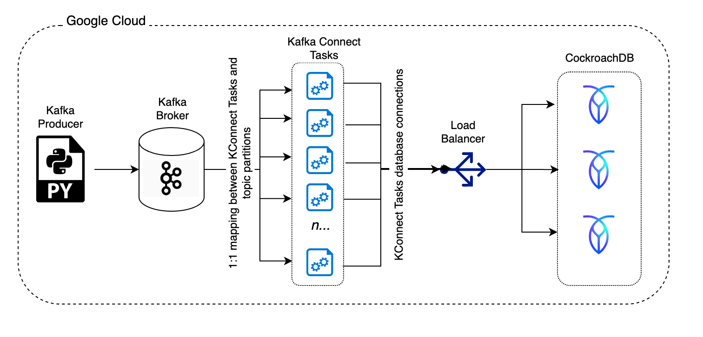

# Kafka 2 CockroachDB via JDBC Sink Connector

This is a short write up on the exercise of inserting batches of Kafka Records into CockroachDB using Confluent's [JDBC Sink Connector](https://docs.confluent.io/kafka-connectors/jdbc/current/sink-connector/overview.html), a 'no-code' solution.

The pipeline is very simple:

## Test Infrastructure and Components Setup

Infrastructure was deployed using Ansible on Google Cloud VMs:

- Single node Confluent Platform (Kafka broker and Kafka Connect) on a `n2-standard-16` instance type.
- 3 nodes CockroachDB cluster using the `n2d-standard-16` instance type.
  Each VM was provisioned with 1 x 2.5TB Persistent SSD (`pd-ssd`) volume.
- Single node Load Balancer instance running HAProxy.

The main Kafka backend was installed using the [Ansible Playbooks for Confluent Platform](https://docs.confluent.io/ansible/current/overview.html).

The CockroachDB cluster and the HAProxy load balancer instance were installed using the [`fabiog1901.cockroachdb` Ansible Collection](https://github.com/fabiog1901/cockroachdb-collection).

The test was run executing convenience Python script `play.py`.
The script coordinates the execution of 4 Ansible Playbooks:

1. `kafka.yaml` - Provision and prepare the Kafka cluster.
2. `cockroachdb.yaml` - Provision and prepare the CockroachDB cluster.
3. `kafka-producer.yaml` - Prepare Kafka broker and Run the Kafka producer.
4. `kafka-consumer.yaml` - Run the Kafka consumer i.e. Kafka Connect and collect stats.

### Kafka Producer

To load data into the Kafka Topic we used a simple generator written in Python, `gen.py`, available in the `libs` folder of this repo.
The generator leverages the `confluent-kafka` [package](https://github.com/confluentinc/confluent-kafka-python) for publishing Avro records of about 60 fields.
The generator is started and let run for 5 minutes before any consumer process is started, so that the Topic is always well filled with records.

### Kafka Consumer

Kafka Connect was configured with the **JDBC Sink Connector**, however, a custom `kafka-connect-jdbc-10.6.1.jar` file was used: the only change made to the original version was to set `autocommit=true` for the SQL transactions, [here](https://github.com/confluentinc/kafka-connect-jdbc/blob/v10.6.1/src/main/java/io/confluent/connect/jdbc/sink/JdbcDbWriter.java#L57).
This change is important as it allows statements to be executed implicitly, saving therefore a roundtrip for the commit message.

## CockroachDB Cluster

The CockroachDB cluster runs version 22.2.2 with the default settings.
The database was seeded with approximately 0.5TB of data.
The data was generated externally and imported from Google Cloud Storage directly into the database.

## Test Description

We tested with multiple Topic **partitions** and **batch sizes**.

Script `play.py` was used to run the tests.
In short, we cycled through all partitions, and for each partition, we cycled through all batch sizes.

On each **partition** cycle, the JDBC Sink Connector was created with `tasks.max` set to the same number as the partition count.
Here, a _task_ is a process that creates a database connection, consumes records from the assigned topic partition, prepares the INSERT statement and finally sends it to CockroachDB for execution.

On each **batch size** cycle, the JDBC Sink Connector was created with `batch.size` and `consumer.override.max.poll.records` set to the current value.

Results of transaction latency, throughput (TPS) and CPU util are shown below for each of the test cases.
`latency_per_txn` is a derived by dividing `txn_latency_ms` by `batch_size`.

| k_partitions | batch_size | tps   | cpu_util_pct | txn_latency_ms | latency_per_txn |
| ------------ | ---------- | ----- | ------------ | -------------- | --------------- |
| 18           | 1          | 2955  | 20           | 3.30           | 3.30            |
| 18           | 16         | 12104 | 65           | 19.00          | 1.19            |
| 18           | 32         | 13824 | 65           | 35.00          | 1.09            |
| 18           | 64         | 16187 | 70           | 61.00          | 0.95            |
| 18           | 128        | 18558 | 75           | 105.00         | 0.82            |
| 36           | 1          | 5846  | 35           | 3.30           | 3.30            |
| 36           | 16         | 14061 | 70           | 35.00          | 2.19            |
| 36           | 32         | 16187 | 75           | 63.00          | 1.97            |
| 36           | 64         | 18700 | 75           | 109.00         | 1.70            |
| 36           | 128        | 21231 | 80           | 188.00         | 1.47            |
| 54           | 1          | 8070  | 50           | 3.80           | 3.80            |
| 54           | 16         | 14788 | 75           | 52.00          | 3.25            |
| 54           | 32         | 16641 | 75           | 94.00          | 2.94            |
| 54           | 64         | 20007 | 80           | 154.00         | 2.41            |
| 54           | 128        | 20485 | 80           | 298.00         | 2.33            |
| 72           | 1          | 10237 | 60           | 4.10           | 4.10            |
| 72           | 16         | 15456 | 75           | 67.00          | 4.19            |
| 72           | 32         | 18817 | 80           | 111.00         | 3.47            |
| 72           | 64         | 19569 | 80           | 212.00         | 3.31            |
| 72           | 128        | 18393 | 80           | 441.00         | 3.45            |
| 90           | 1          | 11153 | 65           | 5.00           | 5.00            |
| 90           | 16         | 15526 | 75           | 85.00          | 5.31            |
| 90           | 32         | 18632 | 75           | 141.00         | 4.41            |
| 90           | 64         | 18488 | 80           | 277.00         | 4.33            |
| 90           | 128        | 18043 | 80           | 569.00         | 4.45            |

## References

- [Ansible Playbooks for Confluent Platform](https://docs.confluent.io/ansible/current/overview.html)
- [fabiog1901.cockroachdb Ansible Collection](https://github.com/fabiog1901/cockroachdb-collection)
- [JDBC Sink Connector](https://docs.confluent.io/kafka-connectors/jdbc/current/sink-connector/overview.html)
- [Confluent's Python Client confluent-kafka](https://github.com/confluentinc/confluent-kafka-python)
- [PostgreSQL JDBC Driver](https://jdbc.postgresql.org/)
